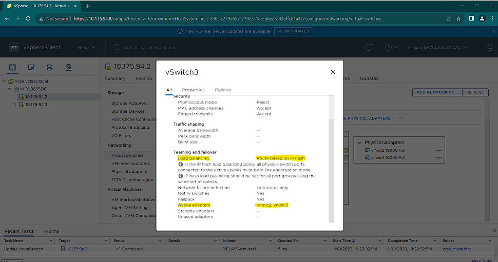

# Private Cloud Network Lab

This project demonstrates hands-on experience configuring networking in a **vSphere-based private cloud** environment. It covers setting up **Production, Isolated, and High Availability networks** for ESXi hosts, emphasizing effective VM communication, security, redundancy, and performance.

---

## 🚀 Lab Objectives
- Configure **VM Production Networks** for performance and security.
- Create **Isolated VM Networks** for testing and staging.
- Implement **High Availability Networks** with active-active uplinks and load balancing.
- Gain practical knowledge of **vSwitches, port groups, VLANs, and uplinks**.

---

## 🖥️ Environment
- vSphere Client / vCenter Server Appliance (VCSA)
- Two ESXi Hosts: `10.175.94.2` and `10.175.94.3`
- Standard vSwitches (vSwitch1, vSwitch2, vSwitch3)
- Physical network adapters: `vmnic1`, `vmnic2`, `vmnic3`
- MTU: 1500 bytes (default)

---

## Task 1 – Configure a VM Production Network

**Goal:** Set up a Production Network for VMs with improved performance and security.

**Steps:**
1. Create a **port group** on each ESXi host.
2. Associate the port group with a **new standard virtual switch** on each host.
3. Use `vmnic1` as the uplink.

**Network Label:** `8881995-Production`  
**MTU:** 1500 bytes  

**Screenshots:**

- Details of vSwitch1 on both hosts
- 
  

  

**Key Takeaways:**
- Consistent port group naming simplifies administration and troubleshooting.
- Standard switches are suitable for local network settings, while distributed switches provide centralized network management.

---

## Task 2 – Configure a VM Isolated Network

**Goal:** Set up an isolated VM network for testing, troubleshooting, and learning.

**Steps:**
1. Create a **port group** on each ESXi host.
2. Associate the port group with a **new standard virtual switch**, **without a physical uplink**.

**Network Label:** `8881995-Test`  

**Screenshots:**

- Adding isolated network on ESXi Host 1

  
  
- Adding isolated network on ESXi Host 2

  

**Key Takeaways:**
- Isolated networks improve security and privacy.
- Ideal for testing and staging environments without impacting production traffic.

---

## Task 3 – Configure a High Availability VM Network

**Goal:** Create a high availability network with redundancy and load balancing.

**Steps:**
1. Create a **port group** on a new standard virtual switch for each host.
2. Use **both `vmnic2` and `vmnic3`** as uplinks.
3. Enable **active-active teaming**.
4. Set **load balancing to IP Hash**.
5. Delete the virtual switches after lab completion.

**Network Label:** `8881995-Demo`  

**Screenshots:**

- Adding HA network on ESXi Host 1

  
  
- Configuring IP Hash load balancing

  

  
  
- Adding HA network on ESXi Host 2

  
  

**Key Takeaways:**
- **IP Hash load balancing** distributes traffic based on IP addresses for performance and session persistence.
- Active-active uplinks guarantee **high availability and redundancy**.
- Ensures reliable network connectivity and minimizes downtime.

---

## 🔧 Reflections & Learnings
- Learned the importance of **consistent port group naming**.
- Gained insights into **standard vs distributed switches**.
- Understood **isolated networks** for testing and staging.
- Configured **high availability networks** with load balancing and redundancy.
- Hands-on experience in **VM networking for private cloud infrastructure**.

---

## 💡 Skills Demonstrated
- vSphere / ESXi Networking  
- VM Port Groups & VLANs  
- Standard Virtual Switch Configuration  
- Network Redundancy & High Availability  
- Load Balancing (IP Hash)  
- Private Cloud Network Management  

